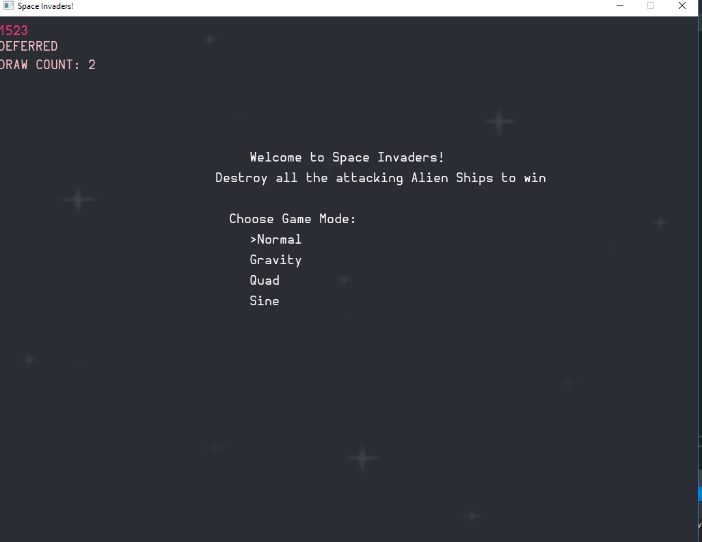
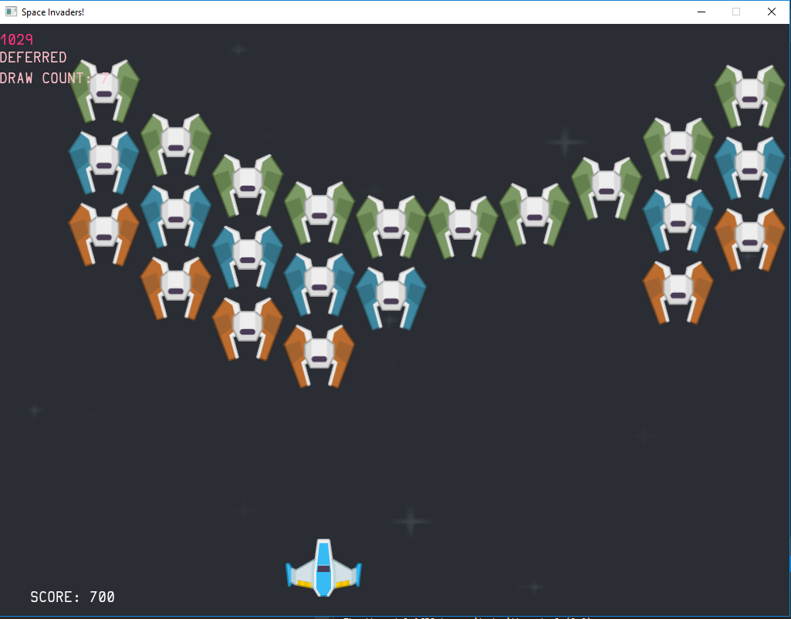
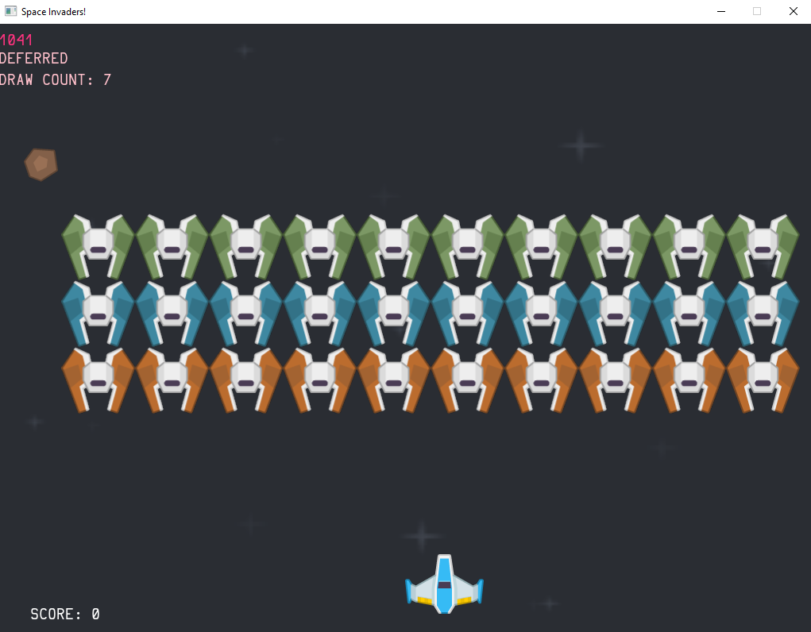

I've made a <b>Space Invaders</b> game in the AwesomeSauceGameEngine, written in C++.
I learnt a lot developing this including: 
How to utitlise Git features properly  
Use of Enum Classes in switch cases.  
Use of Sine and Quadratic Formulaes within games
<!--more-->

Here are some screenshots of my menu, my quadratic game mode which uses a quadratic formula and my standard gamemode.

<figure>
	
    
	
</figure>

