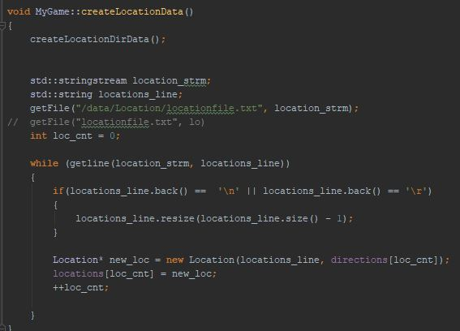

For my first second year assignment, we were asked to convert this **[game](http://www.colorcomputerarchive.com/coco/Documents/Books/Write%20Your%20Own%20Adventure%20Programs%20(1983)(Usborne).pdf)** into C++ using the ASGE Engine.

To fully modernise my game, I decided to base my game on a spaceship instead of a haunted house. I wanted to keep a horror element, so loosely based the game on the horror game, Dead Space.
<figure>
    
 </figure>
    
  ### Key Features
 - This was my first game that used text validation
 - The game relied heavily on file reading for:
    - the route that the player uses
    - the items that the player can collect
  <figure> 
    
   </figure>
   
   <figure>
    
   </figure>
    
    
    
