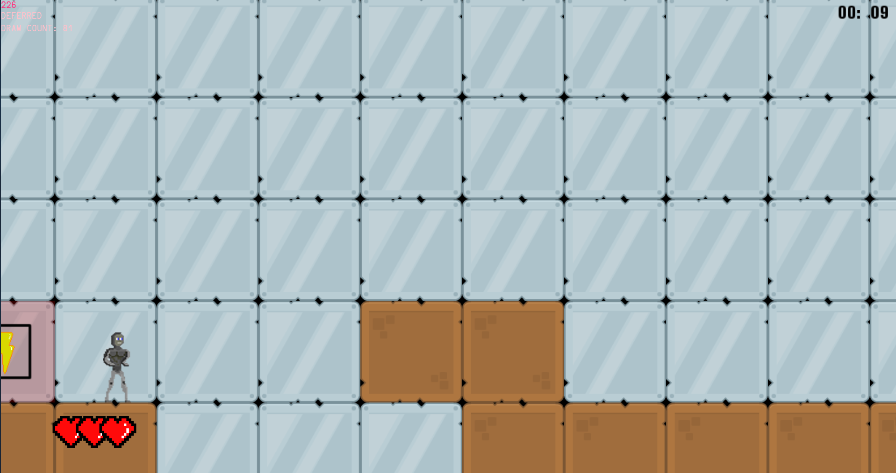

# Ex Machina Platformer

## Based on the oscar award winning film, Ex Machina - we proudly present...  
<figure>
    
</figure>

In this 2D platform runner, playing as iterations of the Ai, Ava - you must escape Nathan's testing facility.
<figure>
    
</figure>

### Key Features
    - high scores based on level time
    - increasing level difficulty
    - sprite animations
    - powerups
    - a huge (terrifying) animated pixel rendition of Oscar Isaac
 <figure>
    
 </figure>
  

### My Role

I worked as lead developer - designing and creating the level editor as well as the gameplay mechanics.  The group I worked with worked really well as a team, and meant that as while as having a fun, polished game loop, we have well balanced levels and plenty of juice.
You can read about my work on this project <a href="https://mikeratcliffe97.github.io/ExMachinaPostMortem/" target="_blank">here</a>
