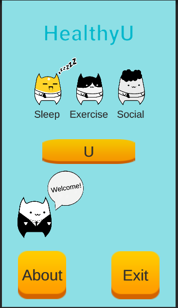
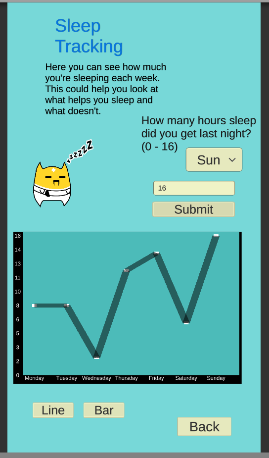
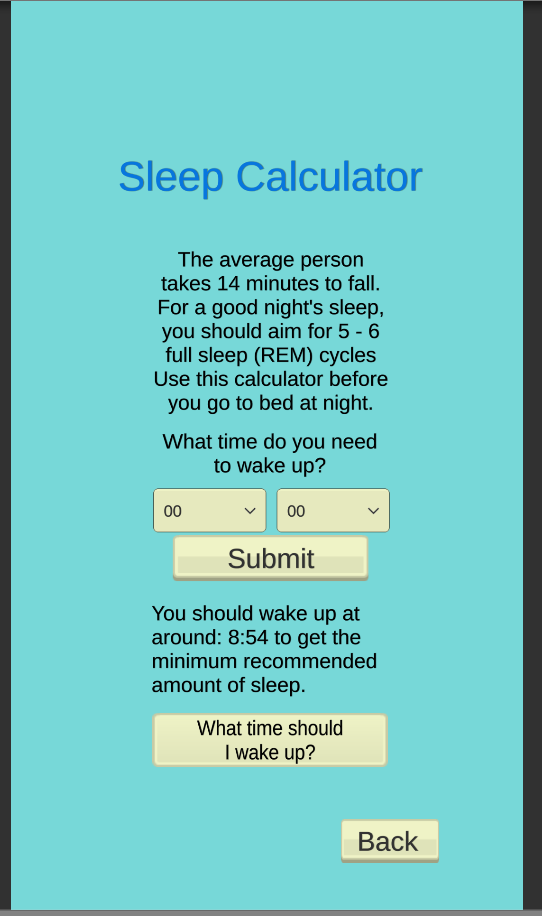

# HealthyU
<figure> 
       

  Designing a health and fitness app through gamification and personalised avatars
 </figure>
 
<b>HealthyU</b> is my dissertation project. I wanted to see if designing an app to improve health and wellbeing in students and young adults using game design methods.

The app tries to encourage healthy lifestyle choices through gameplay.

## Sleep
One of the habits I wanted to encourage was healthy sleep routines. This is proven to have a good impact on psychical and mental health.
To accomplish this, the app features a sleep calculator and a sleep tracking graph.
<figure class="half">
     
    
    <figcaption> Sleep and Graph </figurecaption>
</figure>

Calculator and Graph

## Avatar
    

