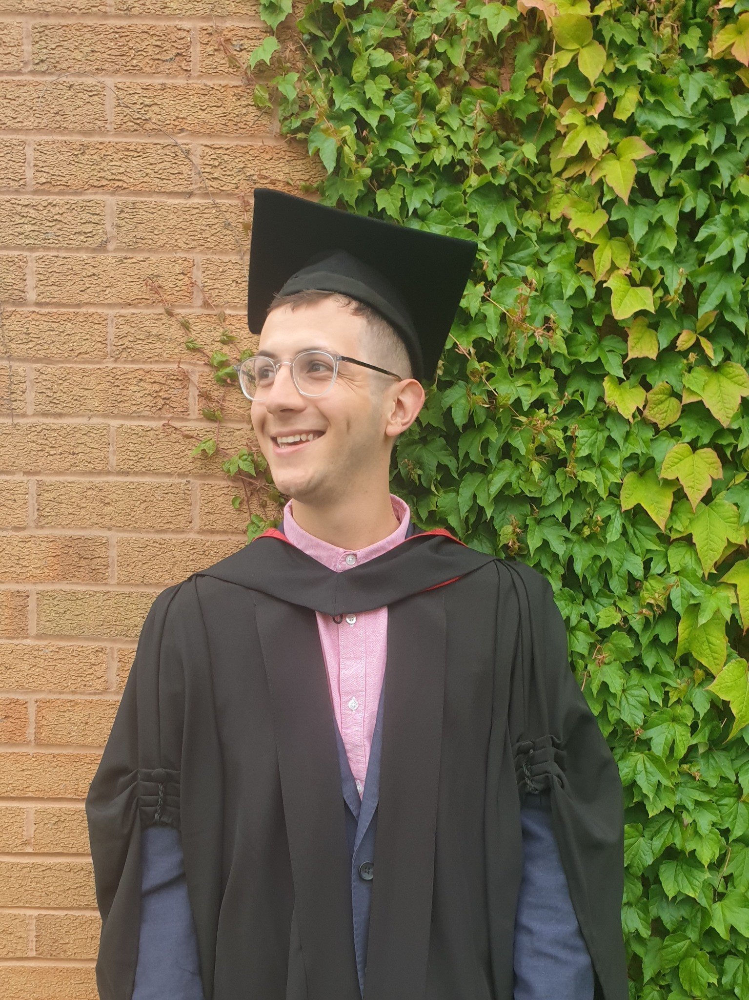

## <b>End of my Degree</b>

Despite a fairly chaotic end to my time at university, I have finished my degree and recieved a 2:1.
Finishing my final year projects during lockdown was a real challenge but I'm pleased with my final grade.
Gutted I can't share a graduation photo as it is postponed until spring but it will be nice to end the course properly.

I will shortly be uploading some demo reels of my work as well as screenshots and breakdowns of parts of my final year projects.

### Update
Please see the posts about my dissertation project, 'HealthyU' my cohort's group project which I produced, 'Don't Walk By' and the Virtual Reality music experience I designed and produced, 'Back in My Day'.

I never did back it to the official graduation ceremony, but I had a photo in the silly hat and had a great evening with my friends celebrating in our own way once covid restrictions were lifted.

<figure>
    
</figure>

