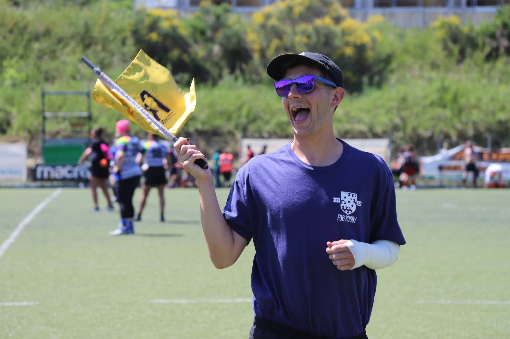

    

<figure>
        
	
</figure>

## About Me

Games Technology Graduate - UWE BSc 2:1  
From London/Worcestershire.  
Based in the Bay, CA with   

Enjoy IPAs, rugby, bouldering, board games and alternative rock.  

Junkrat main and Grand Strategy Game fanatic.  

### Previous roles:-
2021 - 2022 - Technical and Project Support Engineer for getUBetter - digital physiotherapy rehabilition app.  
2021 - 2023 - Developer and Project Manager on Virtual Emergencies - VR based training simulator for student doctors in the NHS.  

# Proud Pet Father

	../assets/img/oreocute.jpg  
	../assets/img/oreoplant.JPG
	../assets/img/oreo.jpg



      
