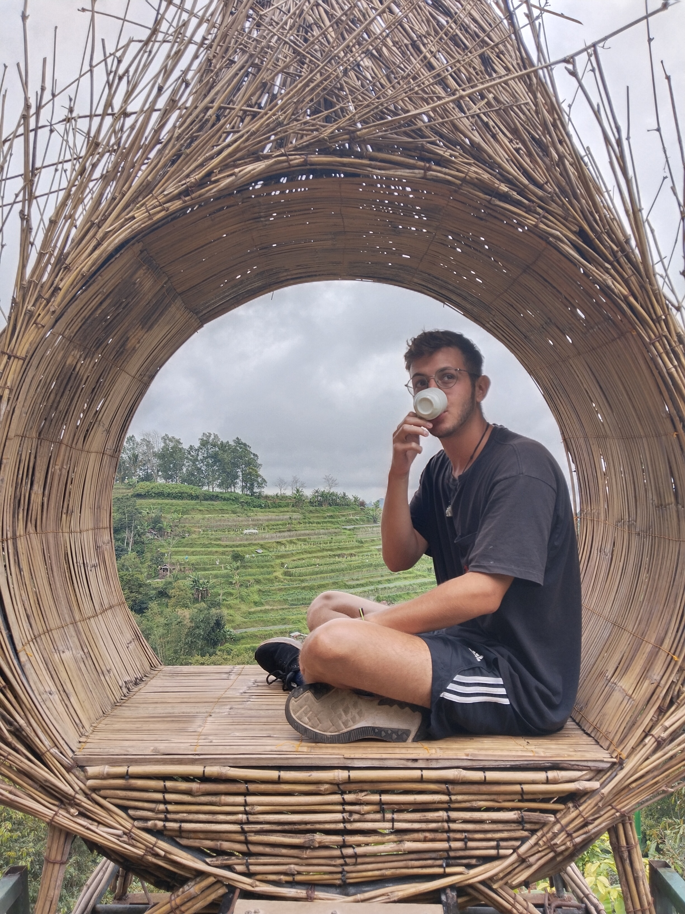

    

<figure>
        
	
</figure>

## About Me

Games Technology Graduate - UWE. 2:1  
From London/Worcestershire.  
Based in Cheltenham, UK  

Enjoy Cider and Indie Rock.  

Junkrat main and Grand Strategy Game fanatic.  

### Previous roles:-
2021 - 2022 - Technical and Project Support Engineer for getUBetter - digital physiotherapy rehabilition app.  
2021 - ongoing - Developer and Project Manager on Virtual Emergencies - VR based training simulator for student doctors in the NHS.  

# Proud Cat Father

	../assets/img/oreocute.jpg  
	../assets/img/oreoplant.JPG



      
