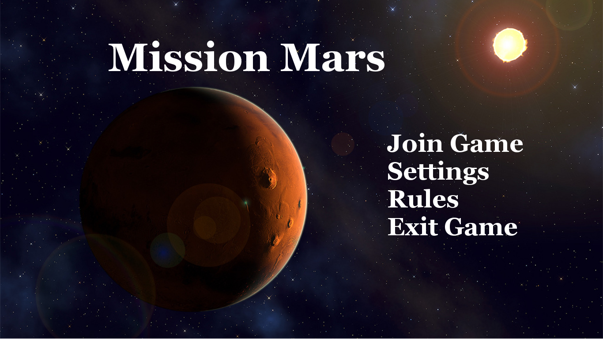
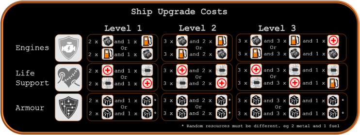

# <b> Mission Mars </b>

The last assignment of the year was to digitise a board game I had made as part of a group earlier in the year.
We had to turn this 4 player board game into a turn-based game over a network.
<figure>
    
    
   </figure>

Part of the implementation was building a server to handle 4 different players connecting, assigning them usernames and allowing them to send text to each other (like a chat room) while holding all the relevant game data. 
We had some issues with different clients falling out of sync, so one player would be further ahead than others. 
Unfortunately this bug occured during our gameplay demo, so to improve I would make sure the packets were sent and recieved properly.

We utilised the SoLoud audio engine to include sound effects and music to create a more immersive experience for the player.
We included the option to control the volume for the sound effects.

The game is in two halves. The first section is about resource management where players collect and spend resources on spaceship parts. Players can see what strategy the other players are using. The sliders that denoted what parts were upgraded were slightly out of sync.
The second section is a race through space where random event cards affect the player based on how well they built their ship.

Overall, I was happy with the gameplay and aesthetics of the game, such as the animations, however ultimately it struggled over a network so I would improve these features.
It worked as a single player or 'hotseat' game. 

